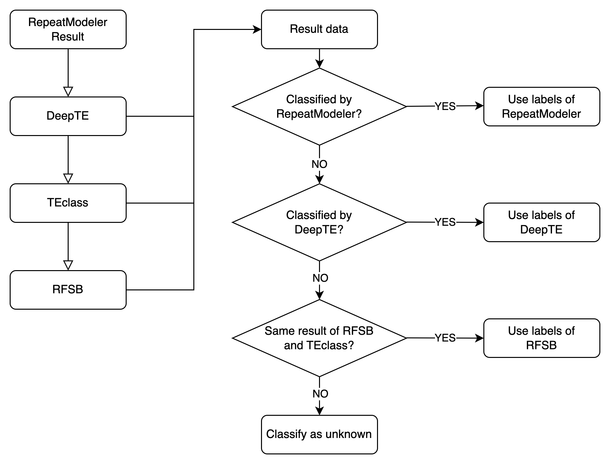

# cTENOR
cTENOR is tool for merging results of TE classify tools

## Pipeline


## Requirements
- DeepTE (Yan et al., 2020)
- TEclass (Abrusán et al., 2009)
- RFSB (TransposonUltimate) (Riehl et al., 2022)


Now, the pipeline is NOT available.  
So, the result file of RepeatModeler(\*-families.fa) -> TEclass(\*.fa) -> RFSB(TransposonUltimate)(\*.txt) is needed.

## Usage
The L mode is not available now!
```
cTENOR version 0.1.0
usage: cTENOR.py [-h] [-fa FASTA] [-sum SUMMARY] [-i INPUT] [{L,S}]

positional arguments:
  {L,S}                 choose run mode; L: change RepeatModeler Library, S: parse RepeatMasker divsum

optional arguments:
  -h, --help            show this help message and exit
  -fa FASTA, --fasta FASTA
                        library fasta file which is outputfile of RepeatModeler (Only required L mode)
  -sum SUMMARY, --summary SUMMARY
                        Result divsum file of RepeatMasker
  -i INPUT, --input INPUT
                        Result txt file of deepTE -> TEclass -> RF
```
